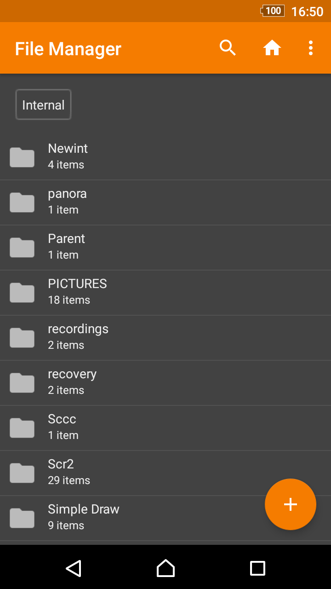
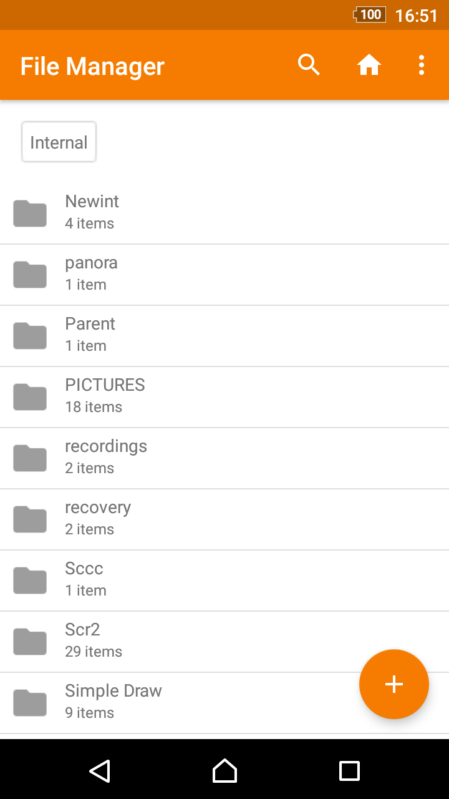
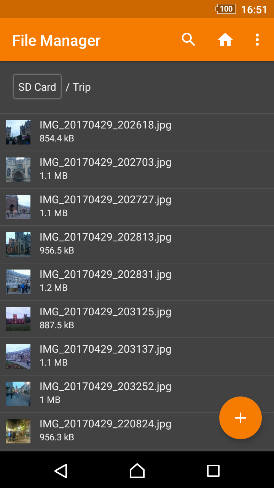

# Simple File Manager

Can also be used for browsing root files and SD card content. You can easily rename, copy, move, delete and share anything you wish.

The fingerprint permission is needed for locking either hidden item visibility, or the whole app.

Contains no ads or unnecessary permissions. It is fully opensource, provides customizable colors.

